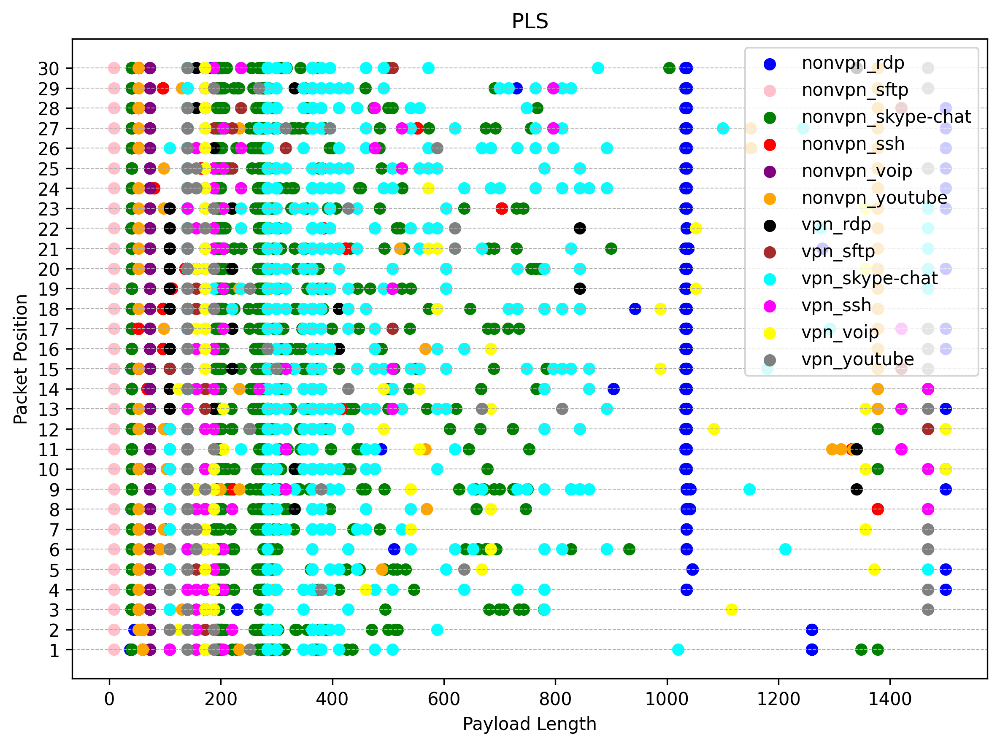
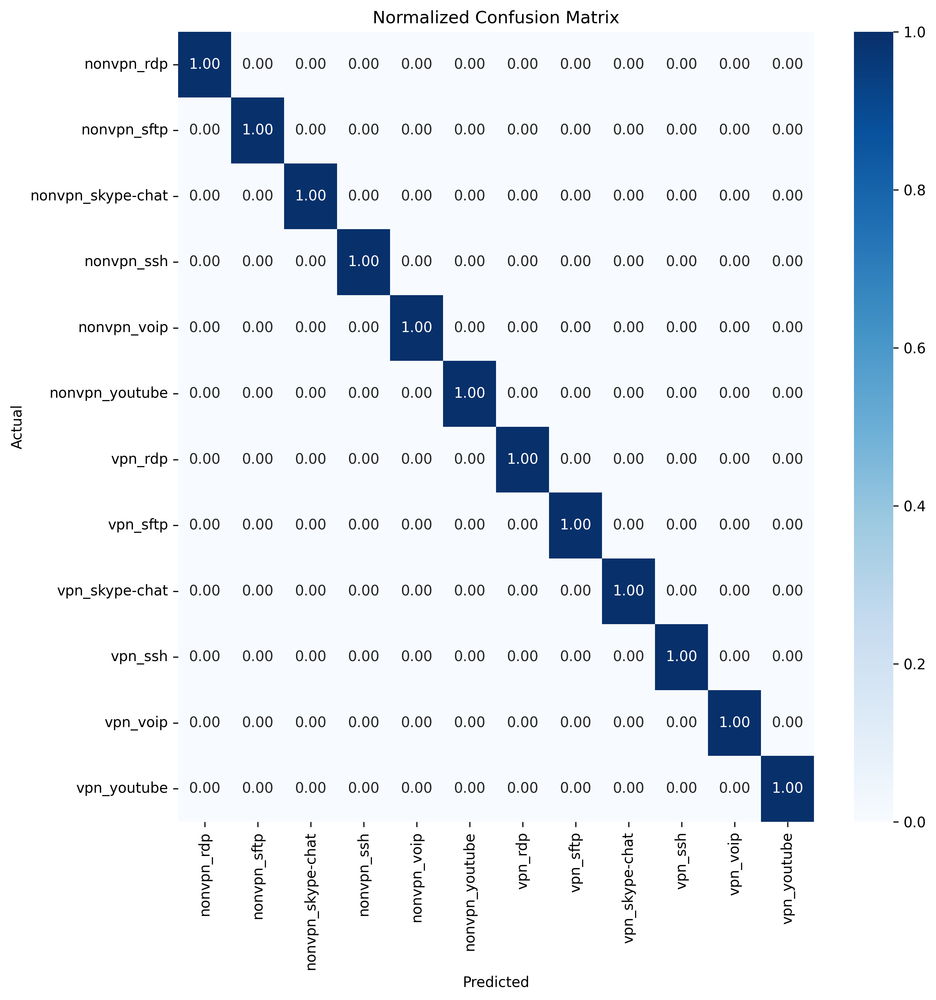
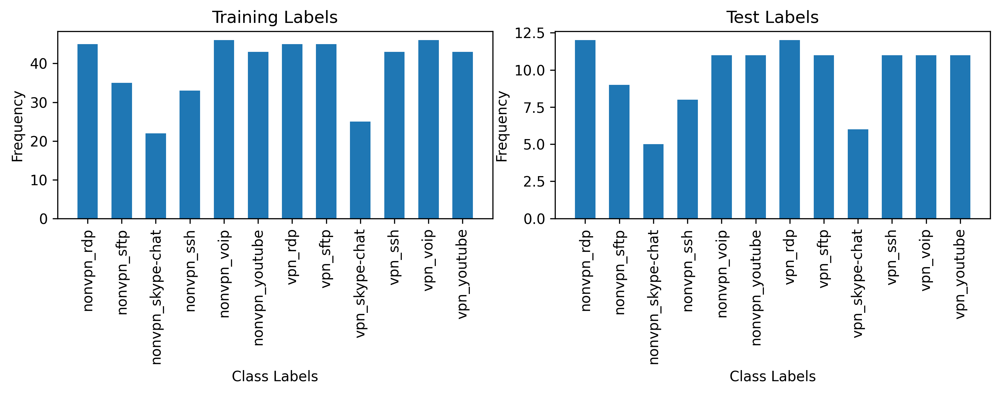
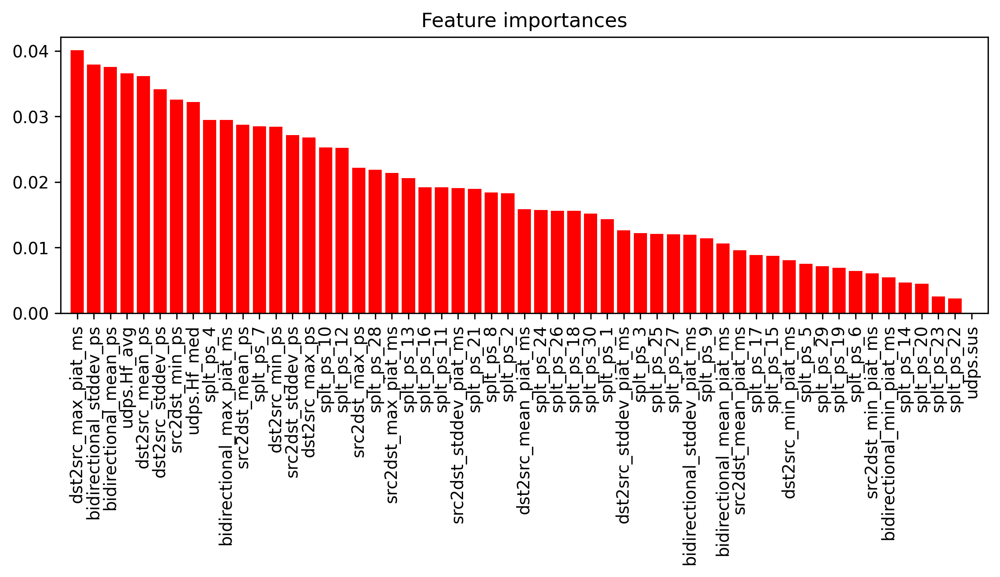

# VPN-forgalom osztályozása Sample Entropy Fingerprint és Payload Length Sequence alapján

## Bemutatás

Ezzel a projekttel az volt a célunk, hogy a Gao és társai által készített tudományosmunka ([VPN Traffic Classification Based on Payload Length Sequence](https://ieeexplore.ieee.org/document/9353766/)) eredményeit reprodukáljuk és kiértékeljük.

A publikáció absztraktja magyar fordításban:

> Az internetes cenzúra megkerülése érdekében egyre több rosszindulatú felhasználó használ Virtual Private Network (VPN) szoftvert, hogy áthatoljon a tűzfalon és hozzáférjen korlátozott erőforrásokhoz. Fontos azonosítani és osztályozni a VPN-forgalmat a hálózatkezelés és a biztonság érdekében. Ebben a tanulmányban 6 különböző típusú VPN-forgalmat elemeznek. A VPN-forgalom jellemzéséhez külön-külön alkalmazzuk a Minta Entrópia Ujjlenyomatot és a Payload Length Sequence (PLS). Ezek alapján Machine Learning (ML) algoritmusokat használunk a VPN-forgalom osztályozóinak létrehozásához. A Deep Packet Inspection (DPI), a Sample Entropy Fingerprint és a PLS-sel való összehasonlítás alapján eredményeink azt mutatják, hogy a PLS-en alapuló osztályozó pontos VPN-forgalom osztályozást érhet el, beleértve az álcázott VPN-forgalmat is.

A kiértékeléshez az adatokat a Jorgensen és társai munkájából ([Extensible Machine Learning for Encrypted Network Traffic Application Labeling via Uncertainty Quantification](https://ieeexplore.ieee.org/document/10044382/)) használtuk fel. 

## Előkészületek

A futtatás előtt a Jupyter Notebook által használt `work` könyvtáron belül egy `pcaps/` alkönyvtárban kell elhelyezni a vizsgálandó csomagelkapások eredményeit (`.pcap` és `.pcapng` fájlok).

## Futtatás
1. Indítsunk el egy [Juptyer Notebook](https://jupyter.org/) környezetet, amely a **Python 3.11**-et használja!
    - Pl.: `docker run --rm -d -p 8888:8888 -v $PWD/hfm:/home/jovyan/work --name jupyter jupyter/base-notebook:x86_64-python-3.11.6`
      - Ha meg szeretnénk spórolni a későbbi indítások során a függőségek telepítését, készíthetünk saját képfájlt is, majd futtathatjuk azzal a fenti parancsot: `docker build -t jupyter-pluplus .`
1. Másoljuk ki a távoli hozzáféréshez kapott URL-t!
    - Pl.: `docker logs jupyter`
1. Nyissuk meg egy tetszőleges Jupyter Notebook támogatással rendelkező szövegszerkesztőben vagy IDE-ben (pl. [VSCode](https://code.visualstudio.com/)-ban) a [Notebook](hfm/hfm.ipynb) fájlt, majd állítsuk be a futtatókörnyezetét az előző lépésben megszerzett URL bemásolásával!
    - Pl.: 

## Eredmények

Az alábbiakban bemutatjuk a kísérleteink eredményeit különböző vizualizációk segítségével:

### Packet Length Sequence

A fenti ábra a csomagok hosszának sorrendjét mutatja, amelyet a VPN-forgalom osztályozásához használtunk.

### Confusion Matrix

A zavaró mátrix segítségével értékeltük a modellünk teljesítményét. Az ábra a helyes és helytelen osztályozások számát mutatja.

### Label Frequencies

Az ábra a különböző címkék gyakoriságát mutatja az adatainkban, amelyeket a modell betanításához használtunk.

### Feature Importances

Az ábra a különböző jellemzők fontosságát mutatja a modellünk számára. Ezek a jellemzők segítettek a VPN-forgalom pontos osztályozásában.

## Szerzők
- Pomucz Tamás András
- Szatmári Soma
- Szatmáry Zoltán
- Szilvágyi Dániel Zoltán
